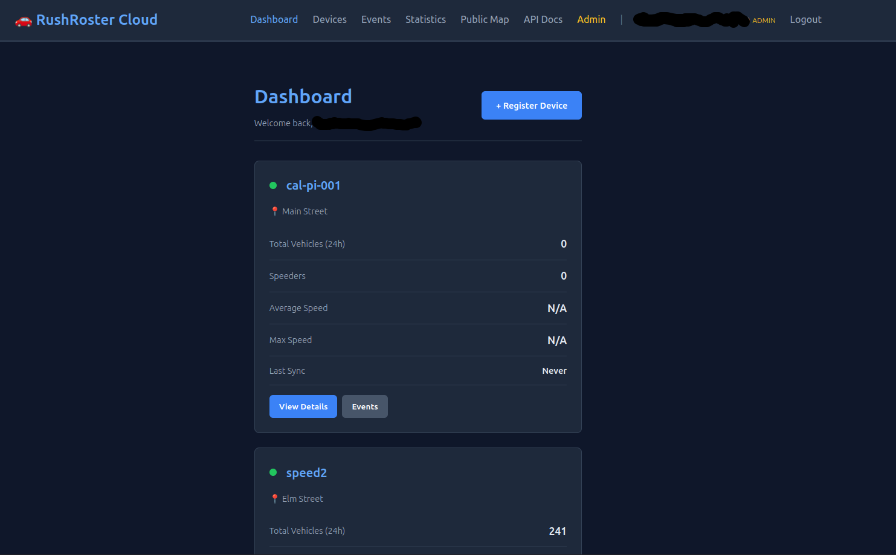
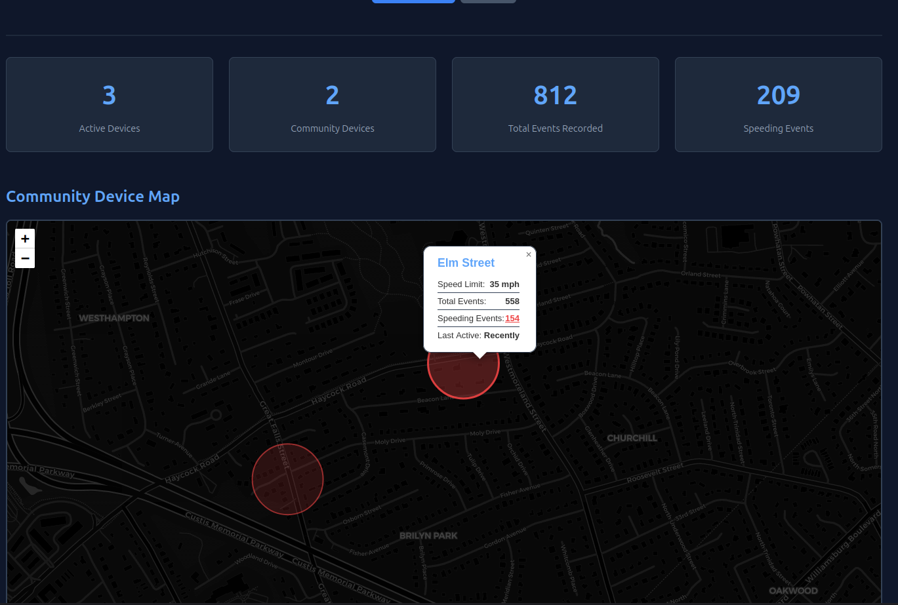
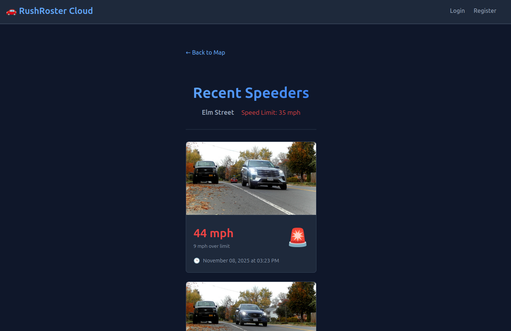

# RushRoster Cloud

> **Central cloud platform for managing distributed speed monitoring field devices**

RushRoster Cloud is the cloud companion to [RushRoster Field Device](https://github.com/calz1/rushroster-field), providing centralized management, analytics, and visualization for distributed Raspberry Pi-based speed monitoring systems. Together, they form a complete ecosystem for community-driven traffic safety monitoring.

## Overview

RushRoster Cloud aggregates speed detection data from multiple field devices, enabling users to monitor traffic patterns across locations, generate reports for authorities, and participate in community awareness initiatives. The platform is designed to work seamlessly with field devices that can operate independently while syncing data when connectivity is available.

I created this platform to complement the field devices by providing a unified dashboard where I could track speeding patterns across multiple locations, generate evidence reports for local authorities, and share anonymized data with my community to raise awareness about traffic safety concerns.

## Key Features

- **Multi-Device Management**: Monitor and manage multiple field devices from a single dashboard
- **Data Aggregation**: Collect and store speed events and photos from distributed field devices
- **Web Dashboard**: Interactive map-based visualization of speed events across all your devices
- **Statistics & Analytics**: Track trends, speed distributions, and traffic patterns over time
- **User Authentication**: Secure account management with JWT-based authentication
- **Admin Panel**: Manage users, devices, and registration codes
- **Community Features**: Opt-in data sharing for neighborhood awareness (coming soon)
- **Report Generation**: Create exportable reports for authorities (coming soon)

## Technology Stack

| Component | Technology |
|-----------|------------|
| Runtime | Python 3.11+ with UV package manager |
| Web Framework | FastAPI + Uvicorn |
| Database | PostgreSQL 15+ |
| ORM | SQLAlchemy 2.0 with Alembic migrations |
| Authentication | JWT tokens with bcrypt password hashing |
| Object Storage | boto3 (S3-compatible) or local filesystem |
| Frontend | Jinja2 templates with vanilla JavaScript |
| Deployment | Docker/Podman containers |

## Screenshots

### Dashboard Overview


### Interactive Map View


### Event Detail Drilldown


## Installation

### Prerequisites

- Python 3.11 or higher
- PostgreSQL 15 or higher (or use included Docker setup)
- UV package manager

### Quick Start (Docker/Podman)

**Recommended for production deployments**

1. **Clone the repository**:
```bash
git clone https://github.com/calz1/rushroster-cloud
cd rushroster-cloud
```

2. **Configure environment variables**:
```bash
cp .env.example .env
# Edit .env and set secure values for JWT_SECRET_KEY and POSTGRES_PASSWORD
```

Generate secure secrets:
```bash
python3 -c 'import secrets; print(f"JWT_SECRET_KEY={secrets.token_urlsafe(32)}")'
python3 -c 'import secrets; print(f"POSTGRES_PASSWORD={secrets.token_urlsafe(32)}")'
```

3. **Start the application**:
```bash
docker-compose up -d
# or with Podman:
podman-compose up -d
```

4. **Access the dashboard**:
- Web Dashboard: http://localhost:8000
- API Documentation: http://localhost:8000/docs (requires login)
- Health Check: http://localhost:8000/health

### Local Development Setup

1. **Install UV package manager**:
```bash
curl -LsSf https://astral.sh/uv/install.sh | sh
```

2. **Clone and install dependencies**:
```bash
git clone https://github.com/calz1/rushroster-cloud
cd rushroster-cloud
uv sync
```

3. **Set up PostgreSQL database**:
```bash
createdb rushroster
psql -U postgres -c "CREATE USER rushroster WITH PASSWORD 'rushroster';"
psql -U postgres -c "GRANT ALL PRIVILEGES ON DATABASE rushroster TO rushroster;"
```

4. **Configure environment**:
```bash
cp .env.example .env
# Edit .env with your database credentials
```

5. **Run database migrations**:
```bash
uv run alembic upgrade head
```

6. **Start the development server**:
```bash
uv run python main.py
```

The application will be available at http://localhost:8000

## Dashboard Features

### User Dashboard
- **Interactive Map**: View all speed events across your devices on an interactive map
- **Device Overview**: Monitor status and health of all registered field devices
- **Statistics Dashboard**: Track speed trends, violation counts, and traffic patterns
- **Event History**: Browse and search through historical speed events with photo evidence
- **Device Registration**: Easy wizard to add new field devices to your account

### Admin Panel
- **User Management**: View and manage user accounts
- **Device Management**: Monitor all devices across all users
- **Registration Codes**: Generate secure codes for new user signups
- **System Statistics**: Global analytics across the entire platform

## API Documentation

The platform provides comprehensive REST APIs for:
- **User Authentication** - Account registration and JWT-based login
- **Device Management** - Register and manage field devices
- **Data Ingestion** - Endpoints for field devices to upload events and photos
- **Statistics & Analytics** - Retrieve aggregated data and trends
- **Admin Operations** - User and device administration

Interactive API documentation is available at:
- **Swagger UI**: http://localhost:8000/docs (requires authentication)
- **ReDoc**: http://localhost:8000/redoc (requires authentication)

## Development

### Running with auto-reload
```bash
uv run uvicorn main:app --reload --host 0.0.0.0 --port 8000
```

### Database migrations
```bash
# Create new migration
uv run alembic revision --autogenerate -m "Description of changes"

# Apply migrations
uv run alembic upgrade head
```

### Running tests
```bash
uv run pytest
```

### Background tasks

Update statistics (run manually or via cron):
```bash
uv run python -m src.tasks.update_stats
```

## Deployment

The application is designed to run in containers using Docker or Podman with the included `docker-compose.yml`.

**Container services**:
- `rushroster-app` - FastAPI application server
- `rushroster-db` - PostgreSQL 16 database

**Data persistence**:
- PostgreSQL data stored in named volume `postgres_data`
- Photos stored in `./data/photos/` (bind mount to host)

**Production considerations**:
- Set strong `JWT_SECRET_KEY` and `POSTGRES_PASSWORD` values
- Run behind reverse proxy (e.g., Caddy) with HTTPS. I personally use a Cloudflare Tunnel.
- Regular backups of database volume and photos directory

See the included `docker-compose.yml` for complete configuration.

## System Architecture

RushRoster Cloud works in tandem with [RushRoster Field Devices](https://github.com/calz1/rushroster-field):

1. **Field devices** operate independently, detecting speeds and capturing photos locally
2. **Cloud sync** happens in the background when network is available
3. **Data aggregation** combines events from multiple devices for unified analytics
4. **Web dashboard** provides centralized monitoring and management
5. **Admin tools** enable user management and registration code generation

Field devices can function completely offline, storing data locally until connectivity is restored.

## Connecting Field Devices

To connect a RushRoster Field Device to your cloud instance:

1. **Register on the cloud platform** at http://your-cloud-instance:8000/register
2. **Add a device** from your dashboard to get a device token
3. **Configure field device** with cloud URL and token in its `config.yaml`:
   ```yaml
   cloud:
     enabled: true
     server_url: "http://your-cloud-instance:8000"
     api_key: "your-device-token"
   ```
4. **Field device syncs** automatically in the background

## License
Affero GPL

## Contributing

Contributions are welcome! Please feel free to submit a Pull Request.

## Support

For issues, questions, or feature requests, please open an issue on GitHub.
